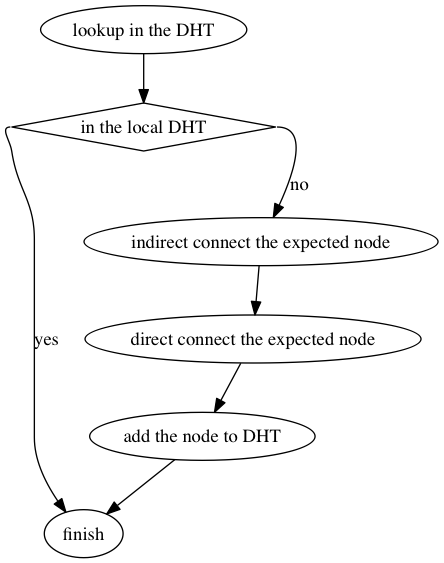
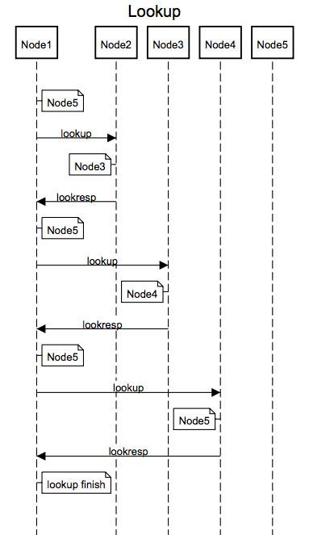
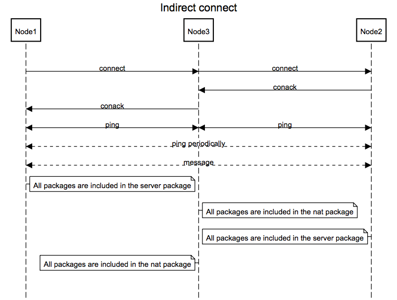
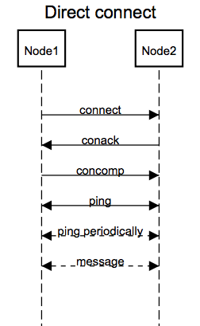
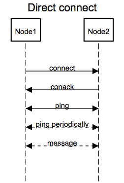

# MATE协议

此协议旨在简化建立点到点（P2P）连接的过程，可用于构建分布式的网络体系。

## 版本
当前版本号：1

## 概述
网络中每个节点都有一个唯一的身份识别码（ID），此ID默认为UUID，不过也可以通过外部接口设定（由外部保证唯一性），用于后续其他节点与之连接。除此之外每个节点还有一张由[Kademlia](http://zh.wikipedia.org/wiki/Kademlia)算法实现的路由表,此节点已知的所有节点（包括自身）信息都存放于其中，用于帮助网络中的节点发现其他节点。
在网络中仅通过ID便可与此ID的节点建立连接，其大致流程如下图所示。

首先在DHT中**寻找目标节点**，如果在本地的路由表中找到目标节点则说明此节点已连接；否则先**间接连接**此目标节点，最后再尝试**直接连接**目标节点。寻找目标节点、间接连接和直接连接的实现细节见下文。

### 寻找目标节点
假设自身节点为Node1，需要寻找节点Node5。首先在Node1的路由表中查询Node5，获得异或距离最近的一些节点信息列表。如果列表中包含Node5则表明已经找到所需节点，发现流程结束；否则继续对列表中每个节点的路由表都发起查询请求，依此递归操作，直到超时。时序图如下。

### 间接连接
假设自身节点为Node1，需要连接的节点为Node2，包含Node2的路由表所在节点为Node3。Node1使用Node3做代理连接Node2，如果连接成功则Node1将Node2连接信息存入本地路由表，Node2将Node1连接信息存入本地路由表。时序图如下。

### 直接连接
假设Node1需要直接连接Node2。如果Node2节点已经处于间接连接状态则采用**三次握手**的方式进行连接；否则采用**两次握手**的方式进行连接，如果连接成功则Node1将Node2连接信息存入（或更新）本地路由表，Node2将Node1连接信息存入（或更新）本地路由表。

#### 三次握手连接
与TCP连接类似，其时序图如下。

包括以下几个步骤：
> 1. 连接发起端向被连接端发送connect；
> 2. 被连接端回应conack；
> 3. 连接发起端回应concomp。

#### 两次握手连接
与三次握手连接基本一致，仅去除concomp过程，其时序图如下。

包括以下几个步骤：
> 1. 连接发起端向被连接端发送connect；
> 2. 被连接端回应conack。

### 心跳
所有位于本地路由表中的节点都应该周期性的发送心跳包，长时间未收到心跳包的节点需要从路由表中移除。

### 消息
可以直接向本地路由表中的任一节点发送消息，接收端收到消息后应该回应响应（Ack），发送端如果一定时间内没有收到响应即认为发送失败。

## 数据包
MATE协议有以下10种类型的数据包：
- lookup
- lookresp
- server
- nat
- connect
- conack
- concomp
- ping
- message
- msgack

所有数据包都使用[bencode](http://zh.wikipedia.org/wiki/Bencode)格式进行编码，下面按概述中叙述的连接流程说明各数据包的结构。

### 寻找目标节点
此过程是一个典型的请求/响应(request–response)式流程，类似于HTTP协议，lookup携带目标节点信息发出请求，lookresp载有查询结果进行响应。

### 直接连接
这个过程与TCP连接过程类似，连接发起端发送含有自身ID的connect包给被连接端，被连接端收到后回复包含被连接端自身ID的conack，最后如果发起端的被连接端处于间接连接状态的话还需要发送含有自身ID的concomp包给被连接端。

### 间接连接
间接连接发送的包类型与直接连接的完全一致，唯一不同的是connect和conack会被包含于server包和nat包中。当连接发起端向被连接端发送connect时需要将connect包进行编码后放进server包中发送给中转节点，中转节点收到server包后将其转化为nat发送给被连接端；反过来也一样，当被连接端向连接发起端回复conack时需要将conack包进行编码后放进server包中发送给中转节点，中转节点收到server包后将其转化为nat发送给被连接端。

### 心跳
心跳是一个单向过程，只需要周期性发送包含自身ID的ping包即可。当节点处于间接连接状态时ping包需要包含于server包和nat包中，server包与nat包结构可以参考间接连接部分。

### 消息
发消息方发送包含消息及自身ID的message包给目标节点，目标节点收到后回复含有自身ID的msgack包即可。当节点处于间接连接状态时message和msgack会被包含于server包和nat包中，server包与nat包结构可以参考间接连接部分。

## 实现
JavaScript(Node.js): https://code.csdn.net/wuyingfengsui/node-mate
